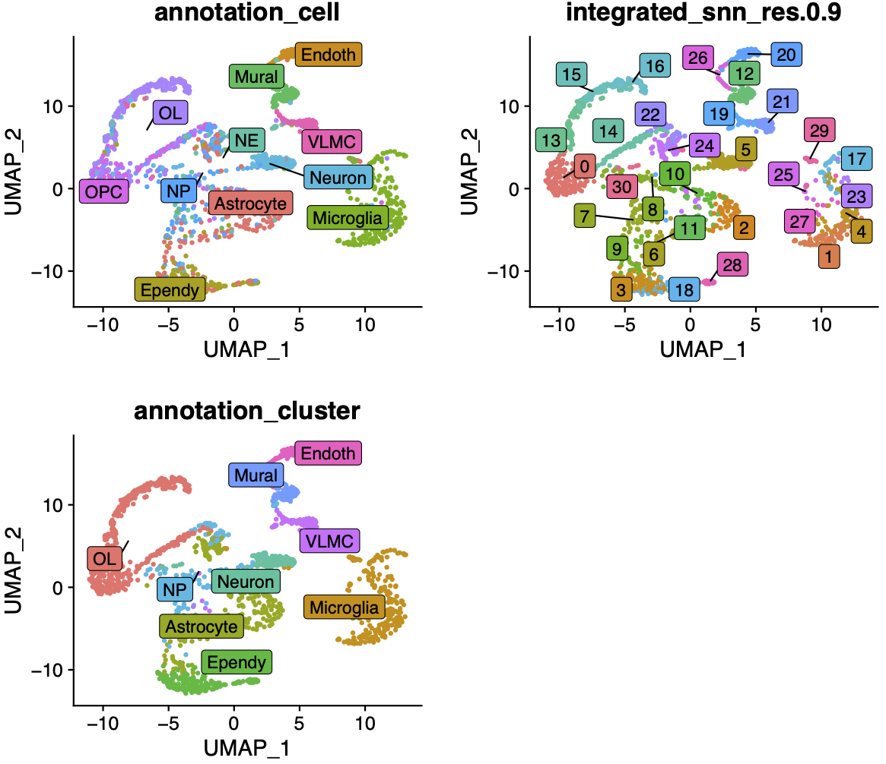
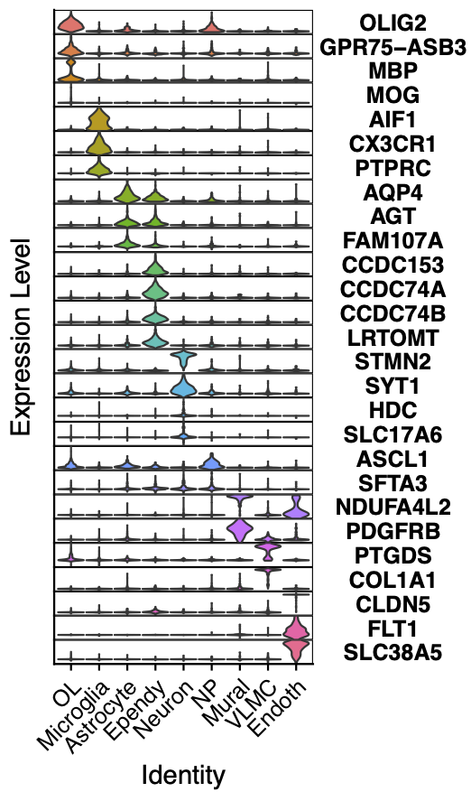
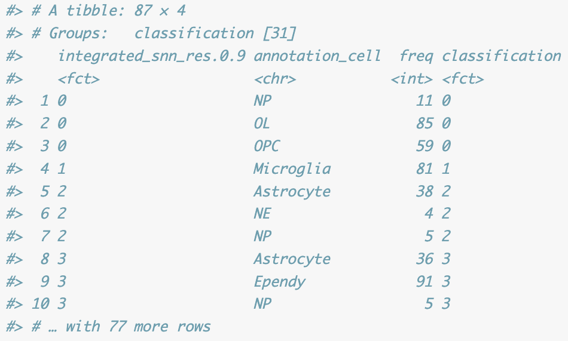

# CellAnnotatoRSeurat
**Annotate cells/cluster according to a marker list, based on a seurat object**

# Quick guide

### 1. Load the package:
**Bash**

    cd ~/bin/
    git clone https://github.com/Maj18/CellAnnotatoRSeurat.git

**R**

    devtools::load_all("~/bin/CellAnnotatoRSeurat")
    #devtools::install_github("Maj18/CellAnnotatoRSeurat")
    library(Matrix)
    library(Seurat)
    library(dplyr)
    library(ggplot2)
    
### 2. Import data

    DIR <- "~/bin/CellAnnotatoRSeurat/example/"
    INDIR <- paste0(DIR, "/data/")
    obj <- readRDS(paste0(INDIR, "gw20_integrated.RDS")) # The dataset is the GW20 data from Zhou et al. 2022 CellStemCell
    
### 3. Define a marker list

    marker.list <- list(NE=c("VIM", "HMGA2", "ARHGAP28", "ALCAM"), NP=c("NES", "ASCL1", "NBPF10", "NBPF15", "PLAGL1", "SFTA3"),
                    Neuron=c("STMN2", "SYT1", "SLC32A1", "GAD2", "HDC", "SLC17A6"), OPC=c("PDGFRA", "GPR75-ASB3"),
                    OL=c("OLIG2", "GPR75-ASB3", "MBP", "MOG"), Astrocyte=c("AQP4", "AGT", "FAM107A"), 
                    Ependy=c("CCDC153", "CCDC74A", "CCDC74B", "LRTOMT"), Microglia=c("AIF1", "CX3CR1","ITGAM", "PTPRC"), 
                    Endoth=c("CLDN5", "FLT1", "SLC38A5"), Mural=c("NDUFA4L2", "PDGFRB"), VLMC=c("PTGDS", "COL1A1"))

### 4. Annotation by cell and by cluster, based on provided markers above

classification="integrated_snn_res.0.9" # classification to be annotated

rslt <- annOnMarker(obj=obj, marker.list, classification=classification)

obj <- rslt$obj

### 5. Check results

**Plot annotation by cell, by cluster, as well as by the original classification side by side**

    cowplot::plot_grid(
        DimPlot(obj, group.by="annotation_cell", label=T, label.box=T, repel=T) + NoLegend(),
        DimPlot(obj, group.by=classification, label=T, label.box=T, repel=T) + NoLegend(),
        DimPlot(obj, group.by="annotation_cluster", label=T, label.box=T, repel=T) + NoLegend(),
        nrow=2
        )
        

        
**To check the quality of the annotation by cluster, we can make a stacked VlnPlot** 

    stackedVlnPlot(obj, marker.list)
    

Check the stacked VlnPlot for improper annotation (such as major marker gene does not express) 
To improve the annotation, either add new marker genes, 
or check the differentially expressed genes of the original classification, to add potentially missed celltypes 
or Considering increasing the classification resolution (e.g. from SCT_snn_res.0.1 to SCT_snn_res.0.3).

**To check other alternative top annotation for each cluster**

    rslt$top3ann
    

